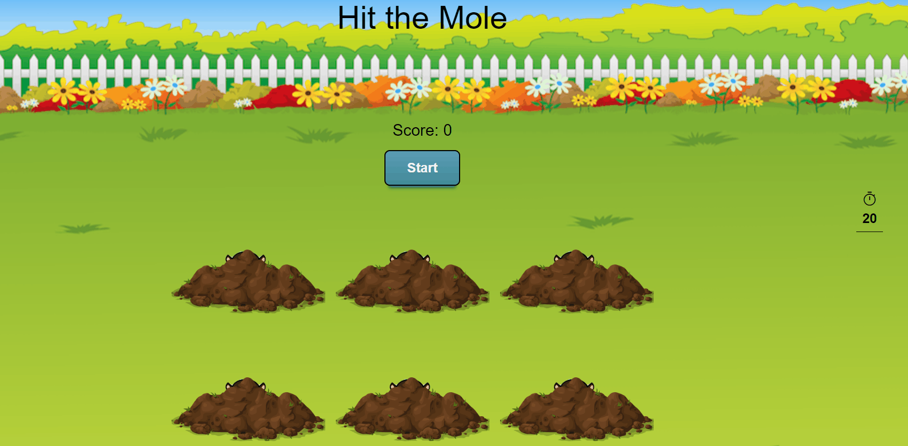

## About The Project
Hit the mole game application is a simple level application made with javascript for entertainment purposes.

<!-- DESCRİPTİON -->
## Description
The game starts with the start button.
Game time is 20 seconds in each start cycle.
The remaining time is displayed with the counter.
In addition, the player's score increases each time he hits a mole.

<!-- PROJECT OUTCOME -->
## Project Outcome

(<a href="#top">back to top</a>)

<!-- CONTACT -->
## Contact

<!-- SUPPORT -->
## Support

 
(<a href="#top">back to top</a>)
